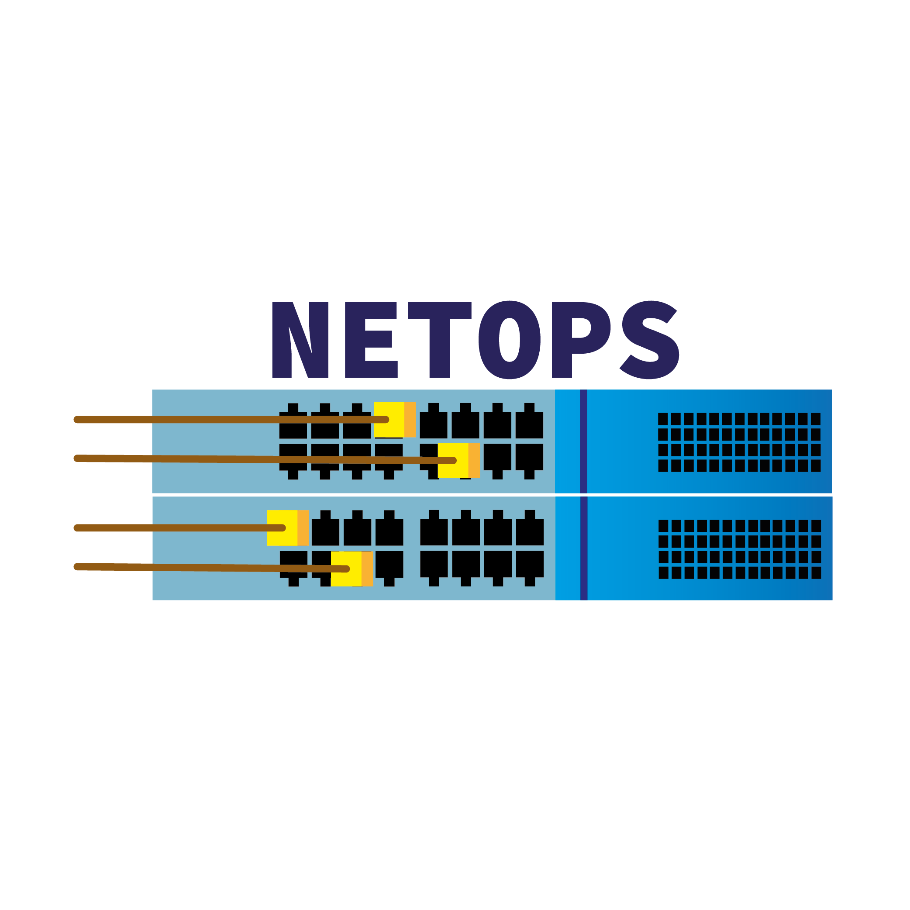

<div id="top"></div>
<!--
*** Thanks for checking out the Best-README-Template. If you have a suggestion
*** that would make this better, please fork the repo and create a pull request
*** or simply open an issue with the tag "enhancement".
*** Don't forget to give the project a star!
*** Thanks again! Now go create something AMAZING! :D
-->


<!-- PROJECT NETOPS -->
<!--
*** I'm using markdown "reference style" links for readability.
*** Reference links are enclosed in brackets [ ] instead of parentheses ( ).
*** See the bottom of this document for the declaration of the reference variables
*** for contributors-url, forks-url, etc. This is an optional, concise syntax you may use.
*** https://www.markdownguide.org/basic-syntax/#reference-style-links
-->
[![Contributors][contributors-shield]][contributors-url]
[![Forks][forks-shield]][forks-url]
[![Stargazers][stars-shield]][stars-url]
[![Issues][issues-shield]][issues-url]
[![MIT License][license-shield]][license-url]
[![LinkedIn][linkedin-shield]][linkedin-url]


<!-- PROJECT LOGO -->
<br />
<div align="center">
  <a href="https://github.com/othneildrew/Best-README-Template">
    
  </a>

  <h3 align="center">NetOps - Project</h3>

  <p align="center">
    Voici notre projet qui nous permet de créer des VLANS en 1 seconde !
    <br />
    <a href="https://github.com/RamexDeltaXOO/Project-NetOps"><strong>Explore the docs »</strong></a>
    <br />
    <br />
    <a href="https://github.com/RamexDeltaXOO/Project-NetOps">View Demo</a>
    ·
    <a href="https://github.com/RamexDeltaXOO/Project-NetOps/issues">Report Bug</a>
    ·
    <a href="https://github.com/RamexDeltaXOO/Project-NetOps/issues">Request Feature</a>
  </p>
</div>


<!-- TABLE OF CONTENTS -->
<details>
  <summary>Table of Contents</summary>
  <ol>
    <li>
      <a href="#about-the-project">About The Project</a>
      <ul>
        <li><a href="#built-with">Built With</a></li>
      </ul>
    </li>
    <li>
      <a href="#getting-started">Getting Started</a>
      <ul>
        <li><a href="#prerequisites">Prerequisites</a></li>
        <li><a href="#installation">Installation</a></li>
      </ul>
    </li>
    <li><a href="#usage">Usage</a></li>
    <li><a href="#roadmap">Roadmap</a></li>
    <li><a href="#contributing">Contributing</a></li>
    <li><a href="#license">License</a></li>
    <li><a href="#contact">Contact</a></li>
    <li><a href="#acknowledgments">Acknowledgments</a></li>
  </ol>
</details>


<!-- ABOUT THE PROJECT -->
## About The Project - (French)

[![Product Name Screen Shot][product-screenshot]](https://github.com/RamexDeltaXOO/Project-NetOps)

* EN QUOI CONSISTE NOTRE PROJET ?	

Le projet est assez simple à comprendre.
Ca consiste a créer une interface WEB assez simple d’utilisation, qui créer des VLAN.

* POURQUOI ?

Nous somme dans une école avec beaucoup d'étudiants.
Beaucoup d’appareils sont connectés et donc pour ne pas encombrer plus le réseaux, la création de Vlan automatiser est nécessaire.

Le projet réponds à cet attente !


<p align="right">(<a href="#top">back to top</a>)</p>


### Built With

* [Javascript](https://devdocs.io/javascript/)
* [Bash](https://devdocs.io/bash/)
* [EXP](https://linux.die.net/man/1/expect)
* [PHP](https://php.net)
* [Bootstrap](https://getbootstrap.com)
* [JQuery](https://jquery.com)

<p align="right">(<a href="#top">back to top</a>)</p>


<!-- GETTING STARTED -->
## Getting Started
Prerequisites is important don't bypass this step.

### Prerequisites

This is an example of how to list things you need to use the software and how to install them.
* Switch HPE Comware 5
* Ubuntu 20.04 + LAMP
* expect
  ```sh
  sudo apt-get install -y expect
  ```
* putty + plink
  ```sh
  sudo apt-get install -y putty
  ```

### Installation

1. Clone the repo
   ```sh
   git clone https://github.com/RamexDeltaXOO/Project-NetOps.git
   ```
2. configure php_action/db_connect.php for database
3. Use SQL database on database/netops.sql
4. Enjoy !

<p align="right">(<a href="#top">back to top</a>)</p>


<!-- USAGE EXAMPLES -->
## Usage

Use this space to show useful examples of how a project can be used. Additional screenshots, code examples and demos work well in this space. You may also link to more resources.

_For more examples, please refer to the [Documentation](https://github.com/RamexDeltaXOO/Project-NetOps)_

<p align="right">(<a href="#top">back to top</a>)</p>


<!-- ROADMAP -->
## Roadmap

- [x] Add possibility to create Vlan automatically via web interface
- [ ] Add possibility to modify Vlan automatically via web interface
- [ ] Add possibility to delete Vlan automatically via web interface
- [ ] Multi-language Support
    - [ ] French
    - [ ] English
    - [ ] Spanish
    - [ ] Arabic

See the [open issues](https://github.com/RamexDeltaXOO/Project-NetOps/issues) for a full list of proposed features (and known issues).

<p align="right">(<a href="#top">back to top</a>)</p>


<!-- CONTRIBUTING -->
## Contributing

Contributions are what make the open source community such an amazing place to learn, inspire, and create. Any contributions you make are **greatly appreciated**.

If you have a suggestion that would make this better, please fork the repo and create a pull request. You can also simply open an issue with the tag "enhancement".
Don't forget to give the project a star! Thanks again!

1. Fork the Project
2. Create your Feature Branch (`git checkout -b feature/AmazingFeature`)
3. Commit your Changes (`git commit -m 'Add some AmazingFeature'`)
4. Push to the Branch (`git push origin feature/AmazingFeature`)
5. Open a Pull Request

<p align="right">(<a href="#top">back to top</a>)</p>


<!-- LICENSE -->
## License

Distributed under the MIT License. See `LICENSE.txt` for more information.

<p align="right">(<a href="#top">back to top</a>)</p>


<!-- CONTACT -->
## Contact

RamexDeltaXOO - contact-netops@gmail.com

Project Link: [https://github.com/RamexDeltaXOO/Project-NetOps](https://github.com/RamexDeltaXOO/Project-NetOps)

<p align="right">(<a href="#top">back to top</a>)</p>


<!-- MARKDOWN LINKS & IMAGES -->
<!-- https://www.markdownguide.org/basic-syntax/#reference-style-links -->
[contributors-shield]: https://img.shields.io/github/contributors/RamexDeltaXOO/Project-NetOps.svg?style=for-the-badge
[contributors-url]: https://github.com/RamexDeltaXOO/Project-NetOps/graphs/contributors
[forks-shield]: https://img.shields.io/github/forks/RamexDeltaXOO/Project-NetOps.svg?style=for-the-badge
[forks-url]: https://github.com/RamexDeltaXOO/Project-NetOps/network/members
[stars-shield]: https://img.shields.io/github/stars/RamexDeltaXOO/Project-NetOps.svg?style=for-the-badge
[stars-url]: https://github.com/RamexDeltaXOO/Project-NetOps/stargazers
[issues-shield]: https://img.shields.io/github/issues/RamexDeltaXOO/Project-NetOps.svg?style=for-the-badge
[issues-url]: https://github.com/RamexDeltaXOO/Project-NetOps/issues
[license-shield]: https://img.shields.io/github/license/RamexDeltaXOO/Project-NetOps.svg?style=for-the-badge
[license-url]: https://github.com/RamexDeltaXOO/Project-NetOps/blob/master/LICENSE.txt
[linkedin-shield]: https://img.shields.io/badge/-LinkedIn-black.svg?style=for-the-badge&logo=linkedin&colorB=555
[linkedin-url]: https://linkedin.com/in/uknown
[product-screenshot]: https://i.ibb.co/g61NZjZ/image.png
